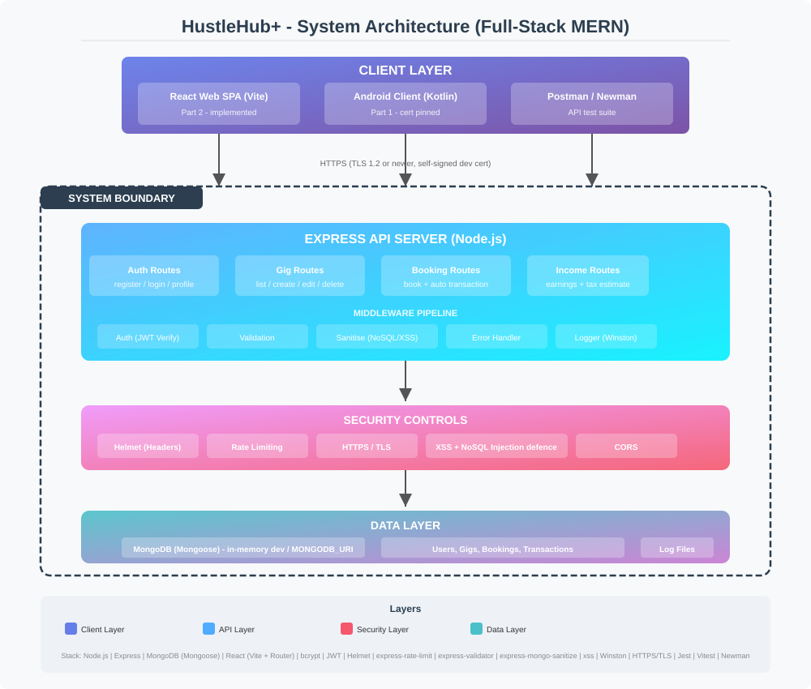

# HustleHub+

A secure freelance marketplace platform backend built with Node.js and Express.

## Submission Artefacts

- **Demonstration video**: <add link to your demo video here — still being made>
- **Postman collection**: [`HustleHub+ Postman Collection.json`](HustleHub%2B%20Postman%20Collection.json)
- **Architecture diagram**: [`architecture-diagram.svg`](architecture-diagram.svg)
- **API response screenshots**: [`docs/screenshots/`](docs/screenshots/)

## Table of Contents

0. [Submission Artefacts](#submission-artefacts)
1. [System Overview](#system-overview)
2. [Intended Users](#intended-users)
3. [Architecture](#architecture)
4. [Backend Structure](#backend-structure)
5. [API Endpoints](#api-endpoints)
6. [Security Decisions](#security-decisions)
   - [Password Hashing](#password-hashing)
   - [Token-Based Authentication](#token-based-authentication)
   - [Input Validation](#input-validation)
   - [HTTPS Configuration](#https-configuration)
   - [Additional Security Measures](#additional-security-measures)
7. [Setup Instructions](#setup-instructions)
8. [Screenshots of API Responses](#screenshots-of-api-responses)

---

## System Overview

HustleHub+ is a freelance marketplace platform that connects freelancers offering services with clients seeking to book those services. The platform processes financial transactions and provides income tracking with estimated tax calculations.

The system follows the **MERN architecture** (MongoDB, Express, React, Node.js). Part 1 delivers the Express/Node API layer with in-memory persistence (to be replaced with MongoDB in a later phase). A native **Android app (Kotlin)** was additionally implemented to consume the API over HTTPS, ahead of the **React web frontend** planned for Part 2.

### Core Features (Current Phase)
- Secure user registration and authentication
- Role-based user accounts (Client, Freelancer; Admin role reserved for platform management)
- JWT-based protected API routes
- HTTPS-secured communications
- Input validation and sanitisation
- Structured error handling and logging

---

## Intended Users

The platform supports three user roles:

| Role | Description |
|------|-------------|
| **Client** | Browses services and books gigs offered by freelancers |
| **Freelancer** | Creates and manages gig listings, earns income, views tax estimates |
| **Admin** | Manages the platform, oversees users and transactions |

---

## Architecture

The MERN stack defines the server-side and browser-side architecture: **MongoDB** (Part 2), **Express**, **React** (Part 2), **Node.js**. Part 1 delivers the Express/Node layer with in-memory persistence, as permitted by the brief. A native **Android client** was additionally implemented in Part 1 to demonstrate the API being consumed over TLS by a real client ahead of the React frontend.



### Diagram Description

The architecture consists of three main layers:

1. **Client Layer**: Two clients consume the API over the same HTTPS boundary — the **React web frontend** (planned for Part 2, sharing the same API) and the **Android app (Kotlin)** implemented in this part. The Android app is built with Retrofit and OkHttp and pins the backend's self-signed certificate, connecting to the backend at `https://10.0.2.2:3443/` from the Android emulator.

2. **API Layer**: The Express.js server sits at the core, routing requests through middleware pipelines:
   - **Security Middleware**: Helmet (HTTP headers), Rate Limiting, HTTPS enforcement
   - **Authentication Middleware**: JWT verification for protected routes
   - **Validation Middleware**: Input sanitisation and validation via express-validator
   - **Error Handling**: Centralised error handler prevents information leakage
   - **Logging**: Winston-based structured logging of system events
   
3. **Data Layer**: Currently uses in-memory storage for user data (to be replaced with MongoDB). Application logs are written to the filesystem.

### System Boundary

The system boundary is the HTTPS interface. All external communication occurs over TLS-encrypted connections. The API server is the sole entry point. Internal components (middleware, controllers, models) operate within the server process boundary.

### Security Boundaries

- **Network Boundary**: HTTPS/TLS encryption protects data in transit
- **Authentication Boundary**: JWT tokens gate access to protected resources
- **Validation Boundary**: All input is validated before processing
- **Error Boundary**: Controlled error responses prevent information disclosure
- **Storage Boundary**: Passwords are hashed before storage (never plain-text)

---

## Backend Structure

```
backend/
├── server.js                 # Entry point - HTTPS server
├── .env                      # Environment variables
├── package.json
├── certs/
│   ├── cert.pem              # SSL certificate (self-signed for development)
│   └── key.pem               # SSL private key
├── logs/                     # Application logs (generated at runtime)
│   ├── combined.log
│   └── error.log
├── scripts/
│   └── generate-cert.js      # Self-signed certificate generator
├── src/
│   ├── app.js                # Express app configuration
│   ├── middleware/
│   │   ├── auth.js           # JWT authentication middleware
│   │   ├── errorHandler.js   # Centralised error handler + AppError class
│   │   └── validate.js       # Input validation rules (register & login)
│   ├── models/
│   │   └── user.js           # User data model (in-memory storage)
│   ├── routes/
│   │   └── auth.js           # Authentication routes (register, login, profile)
│   └── utils/
│       └── logger.js         # Winston logger configuration
└── tests/
    └── auth.test.js          # Jest unit tests for auth endpoints
```

---

## Android App

A native Android client (Kotlin) located in the `android/` folder. It implements the Part 1 requirements on the client side: secure registration, login, and profile retrieval against the HustleHub+ backend.

### Features

- **Splash → Login → Register → Dashboard** flow with token persistence
- **Client-side input validation** mirroring the server rules (email format, password strength, confirm-password match)
- **Encrypted token storage** via `EncryptedSharedPreferences` (AES-256-GCM)
- **Certificate pinning**: the app embeds the backend's self-signed certificate (`res/raw/server_cert.pem`) and only trusts that exact certificate over TLS
- **Server error surfacing**: controlled error messages parsed from the API's JSON error responses

### App Structure

```
android/
├── settings.gradle.kts / build.gradle.kts / gradle.properties
├── app/
│   ├── build.gradle.kts           # AGP 8.1.2, Kotlin 1.9.24, minSdk 26
│   └── src/main/
│       ├── AndroidManifest.xml    # network security config, INTERNET permission
│       ├── res/
│       │   ├── raw/server_cert.pem      # pinned backend certificate
│       │   ├── xml/network_security_config.xml
│       │   ├── layout/            # activity_login, activity_register, activity_dashboard
│       │   └── values/            # dark theme, strings
│       └── java/com/hustlehub/app/
│           ├── MainActivity.kt    # splash + auth routing
│           ├── LoginActivity.kt   # login screen
│           ├── RegisterActivity.kt# registration screen
│           ├── DashboardActivity.kt # profile, JWT, security status
│           ├── HustleHubApplication.kt
│           ├── api/               # Retrofit ApiClient + ApiService
│           ├── model/             # request/response DTOs
│           └── security/          # TokenManager (EncryptedSharedPreferences)
```

### Running the App

1. Start the backend first (see [Setup Instructions](#setup-instructions)).
2. Open the `android/` folder in **Android Studio** (Giraffe 2022.3.1 or newer).
3. Create/start an emulator (API 26–34) — the app connects to the host machine via `https://10.0.2.2:3443/`.
4. Run the `app` configuration. Build output APK: `android/app/build/outputs/apk/debug/app-debug.apk`.

> **Note**: the pinned certificate must match the backend's `certs/cert.pem`. If you regenerate the backend certificate, copy the new `certs/cert.pem` over `android/app/src/main/res/raw/server_cert.pem` and rebuild the app.

---

## API Endpoints

| Method | Endpoint | Auth Required | Description |
|--------|----------|---------------|-------------|
| GET | `/api/health` | No | Health check |
| POST | `/api/auth/register` | No | Register a new user |
| POST | `/api/auth/login` | No | Login and receive JWT |
| GET | `/api/auth/profile` | Yes | Get authenticated user profile |

### Request/Response Examples

**POST /api/auth/register**
```json
// Request
{
  "name": "John Doe",
  "email": "john@example.com",
  "password": "SecurePass1!",
  "role": "freelancer"
}

// Response (201)
{
  "status": "success",
  "message": "User registered successfully",
  "data": {
    "user": {
      "id": 1,
      "name": "John Doe",
      "email": "john@example.com",
      "role": "freelancer",
      "createdAt": "2026-07-29T08:39:06.991Z"
    },
    "token": "eyJhbGciOiJIUzI1NiIs..."
  }
}
```

**POST /api/auth/login**
```json
// Request
{
  "email": "john@example.com",
  "password": "SecurePass1!"
}

// Response (200)
{
  "status": "success",
  "message": "Login successful",
  "data": {
    "user": { "...user data..." },
    "token": "eyJhbGciOiJIUzI1NiIs..."
  }
}
```

---

## Security Decisions

### Password Hashing

**Algorithm**: bcrypt with 12 salt rounds

**Why bcrypt?**
- **Slow by design**: bcrypt is deliberately computationally expensive, making brute-force and rainbow table attacks infeasible. A single bcrypt hash at 12 rounds takes ~250ms to compute, severely limiting attack velocity.
- **Built-in salting**: Each password is automatically combined with a unique cryptographic salt before hashing. This means even if two users have the same password, their stored hashes will be different.
- **Adaptive cost factor**: The cost factor (salt rounds) can be increased as hardware improves, maintaining future security.
- **Proven track record**: bcrypt has been widely peer-reviewed and is considered the industry standard for password storage.

**Implementation**:
```javascript
const hashedPassword = await bcrypt.hash(userData.password, 12);
const isMatch = await bcrypt.compare(password, user.password);
```

Passwords are hashed **before** storage. The plain-text password is never retained. During login, bcrypt's `compare` function performs constant-time comparison to prevent timing attacks.

### Token-Based Authentication

**Algorithm**: JSON Web Tokens (JWT) using HS256 (HMAC with SHA-256)

**Why JWT?**
- **Stateless**: No server-side session storage is required. Tokens are self-contained, reducing database load.
- **Self-validating**: Each token contains the user identity and metadata, signed by the server. No token lookup is needed on each request.
- **Expiration**: Tokens have a configurable expiry (`JWT_EXPIRES_IN = 1h`), limiting the window of compromised token misuse.

**Token Payload**:
```json
{
  "id": 1,
  "email": "john@example.com",
  "role": "freelancer",
  "name": "John Doe",
  "iat": 1785314346,
  "exp": 1785317946
}
```

**Validation Flow**:
1. Client sends `Authorization: Bearer <token>` header
2. Server verifies the token signature using `JWT_SECRET`
3. Server checks token expiration
4. Decoded payload is attached to `req.user` for downstream use
5. Invalid/expired tokens return 401 with appropriate messages

### Input Validation

**Library**: express-validator

**Validation Rules - Registration**:
- **Name**: Required, trimmed, max 100 characters, HTML-escaped
- **Email**: Required, valid email format, normalised (lowercased)
- **Password**: Minimum 8 characters, must contain uppercase, lowercase, number, and special character
- **Role**: Must be one of: `client` or `freelancer`. The `admin` role cannot be self-assigned through any API endpoint (see [Privilege Escalation](#hardening-against-common-attacks)).

**Validation Rules - Login**:
- **Email**: Required, valid email format
- **Password**: Required (non-empty)

**Why validate?**
- **Prevents injection attacks**: Input sanitisation (trim, escape) prevents XSS and other injection vectors
- **Enforces data integrity**: Malformed or incomplete data is rejected before reaching business logic
- **Reduces attack surface**: Strict input constraints limit the types of payloads an attacker can submit
- **User feedback**: Clear validation error messages help legitimate users correct their input

Validation occurs in a middleware pipeline. If validation fails, the middleware immediately responds with a 400 status and descriptive error messages, never reaching the route handler.

### HTTPS Configuration

**Implementation**: The server uses Node.js `https.createServer` with a locally generated SSL certificate.

**Why HTTPS?**
- **Encryption in transit**: All data exchanged between client and server is encrypted using TLS, preventing eavesdropping and man-in-the-middle attacks.
- **Data integrity**: TLS ensures data cannot be tampered with during transmission.
- **Authentication**: The SSL certificate verifies the server's identity to the client.
- **Regulatory compliance**: Many data protection regulations (e.g., POPIA, GDPR) require encryption of personal data in transit.

**Certificate Generation**: A self-signed certificate is generated for development using node-forge. In production, certificates from a trusted Certificate Authority (e.g., Let's Encrypt) would be used.

**Note**: Self-signed certificates trigger browser security warnings. They are appropriate for development and testing but should never be used in production.

### Additional Security Measures

**Helmet**: Sets secure HTTP headers including:
- `Content-Security-Policy` - Controls resource loading
- `X-Content-Type-Options` - Prevents MIME-type sniffing
- `X-Frame-Options` - Prevents clickjacking
- `Strict-Transport-Security` - Enforces HTTPS

**Rate Limiting**:
- Global: 100 requests per 15-minute window per IP
- Auth endpoints: 10 requests per 15-minute window per IP
- Prevents brute-force attacks and DoS attempts

**Request Body Size Limit**: `express.json({ limit: '10kb' })` prevents large payload attacks.

**Controlled Error Responses**: The centralised error handler:
- Returns generic "Internal server error" for unexpected errors
- Only exposes operational error messages (expected failure modes)
- Never reveals stack traces, file paths, or internal configuration
- Logs full error details server-side for debugging

**Structured Logging**: Winston logs all key system events:
- User registration and login attempts
- Authentication failures
- Server errors (with stack traces, logged server-side only)

### Hardening Against Common Attacks

The API has been hardened against the OWASP Top 10 risks most likely to be tested:

**SQL Injection**: The data layer uses an in-memory store — no SQL queries are constructed anywhere, so SQL injection is structurally impossible. As defense in depth, every input is validated with `express-validator` and string fields are HTML-escaped before storage. Verified by tests that send `' OR '1'='1`, `'); DROP TABLE users;--`, and similar payloads.

**Privilege Escalation**: Registration only accepts roles `client` or `freelancer`. The `admin` role cannot be self-assigned through any API endpoint.

**JWT Attacks**: Tokens are pinned to the `HS256` algorithm (`algorithms: ['HS256']`), so `alg: "none"` and algorithm-confusion attacks are rejected. Tokens are bound to an issuer and audience (`hustlehub-plus` / `hustlehub-plus-api`), expire after 1 hour, and are signed with a 51-character random secret. `server.js` fails fast at startup if the secret is missing or under 32 characters.

**Mass Assignment**: Only `name`, `email`, `password`, and `role` are extracted from the request body; unknown fields (e.g. `id`, `isAdmin`, `createdAt`) are silently discarded.

**Malformed Input / Smuggling**: Broken JSON returns a controlled `400 Invalid JSON payload` (no stack traces leaked), and bodies over 10 KB return `413`.

**User Enumeration (timing)**: Login performs a dummy bcrypt comparison when the email does not exist, so account-existence cannot be detected via response timing.

**TLS**: HTTPS server enforces TLS 1.2+ (`minVersion: 'TLSv1.2'`).

All of the above are covered by automated tests in `backend/tests/security.test.js`.

---

## Setup Instructions

### Prerequisites

- Node.js v18 or higher
- npm
- Android Studio Giraffe (2022.3.1) or newer — for the Android app

### Installation

```bash
# Navigate to the backend directory
cd backend

# Install dependencies
npm install

# Create your environment file (it is NOT committed, for security)
cp .env.example .env        # PowerShell: Copy-Item .env.example .env

# Generate a strong JWT_SECRET and paste it into .env
node -e "console.log(require('crypto').randomBytes(32).toString('hex'))"

# Generate SSL certificate
node scripts/generate-cert.js

# Start the server
npm start

# Development mode (with auto-reload)
npm run dev
```

The server will start on `https://localhost:3443`.

> **Note**: the server refuses to start if `JWT_SECRET` is missing or shorter than 32 characters — set it in `.env`.

### Testing with Postman

1. Import the Postman collection from `HustleHub+ Postman Collection.json`
2. Set the `baseUrl` variable to `https://localhost:3443`
3. Disable SSL certificate verification in Postman settings (Settings > General > SSL certificate verification: OFF)
4. Test endpoints in order: Health → Register → Login → Profile
5. The `Profile - Expired Token` request contains a token signed with the development `JWT_SECRET`; if you regenerate your secret, mint a fresh one with:

   ```bash
   node -e "require('dotenv').config(); console.log(require('jsonwebtoken').sign({id:1,email:'expired@example.com',role:'client',name:'Expired User'}, process.env.JWT_SECRET, {expiresIn:'-60s', issuer:'hustlehub-plus', audience:'hustlehub-plus-api'}))"
   ```

---

## Screenshots of API Responses

All screenshots below were captured from Postman and stored in `docs/screenshots/`. Each frame includes the request name, the status code, and the response time.

| # | Request | Expected Status | Screenshot |
|---|---------|-----------------|------------|
| 1 | GET `/api/health` | 200 | `docs/screenshots/01_health.png` |
| 2 | POST `/api/auth/register` — Freelancer success | 201 | `docs/screenshots/02_register_success.png` |
| 3 | POST `/api/auth/register` — Client success | 201 | `docs/screenshots/03_register_client.png` |
| 4 | POST `/api/auth/register` — Duplicate email | 409 | `docs/screenshots/04_register_duplicate.png` |
| 5 | POST `/api/auth/register` — Validation errors | 400 | `docs/screenshots/05_register_validation.png` |
| 6 | POST `/api/auth/register` — Admin role rejected | 400 | `docs/screenshots/06_register_admin_rejected.png` |
| 7 | POST `/api/auth/login` — Success with JWT | 200 | `docs/screenshots/07_login_success.png` |
| 8 | POST `/api/auth/login` — Wrong password | 401 | `docs/screenshots/08_login_wrong_password.png` |
| 9 | POST `/api/auth/login` — Non-existent user | 401 | `docs/screenshots/09_login_no_user.png` |
| 10 | POST `/api/auth/login` — Malformed JSON | 400 | `docs/screenshots/10_login_malformed_json.png` |
| 11 | POST `/api/auth/login` — Oversized body | 413 | `docs/screenshots/11_login_oversized.png` |
| 12 | GET `/api/auth/profile` — Valid token | 200 | `docs/screenshots/12_profile_success.png` |
| 13 | GET `/api/auth/profile` — No token | 401 | `docs/screenshots/13_profile_no_token.png` |
| 14 | GET `/api/auth/profile` — Invalid token | 401 | `docs/screenshots/14_profile_invalid_token.png` |
| 15 | GET `/api/auth/profile` — Expired token | 401 | `docs/screenshots/15_profile_expired_token.png` |
| 16 | GET `/api/unknown/route` — Not found | 404 | `docs/screenshots/16_404_unknown_route.png` |

### Running Tests

```bash
npm test
```
